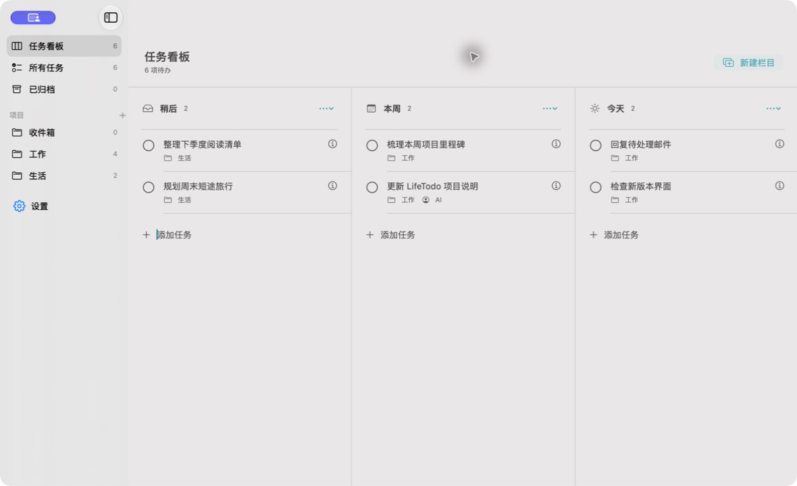

# LifeTodo

LifeTodo 是一款 macOS 状态栏待办应用。它提供可自定义的任务看板、项目分类和本机 MCP 服务，让你既能手动整理待办，也能让 AI 协作创建任务、认领工作和汇报进度。任务使用 SwiftData 保存在本机。



> 界面截图使用隔离的演示任务，不包含真实用户数据。

## 主要功能

- **两种状态栏习惯**：点击状态栏图标可选择展开待办列表，或直接打开/收起管理窗口。
- **可定制看板**：默认提供「稍后」「本周」「今天」三栏；支持新建、重命名、移动和删除栏目，以及拖动任务到其他栏目。这些栏目是手动分类，不会根据日期自动移动任务。
- **任务与项目**：快速添加任务、按项目查看、编辑、完成、归档和恢复；「所有任务」可搜索和筛选。
- **原生 macOS 界面**：SwiftUI 与 AppKit 构建的半透明窗口和状态栏弹出面板。关闭窗口默认只收起窗口，仍在状态栏运行；可在设置中改为退出应用。
- **AI 协作**：内置本机 MCP 服务，支持查询项目/任务、创建任务、认领任务、报告进度、完成任务和获取进度摘要。

## 运行与构建

项目要求 **macOS 26.0 或更新版本**，从源码构建需安装带 macOS 26 SDK 的 Xcode。

仓库中的开发版应用位于 [`app/LifeTodoList.app`](app/LifeTodoList.app)。也可以在 Xcode 中打开 `LifeTodoList.xcodeproj`，选择 `LifeTodoList` scheme 运行。命令行构建示例：

```sh
xcodebuild -project LifeTodoList.xcodeproj \
  -scheme LifeTodoList \
  -configuration Debug \
  -derivedDataPath /tmp/LifeTodoListDerivedData \
  CODE_SIGNING_ALLOWED=NO build
```

产物位于 `/tmp/LifeTodoListDerivedData/Build/Products/Debug/LifeTodoList.app`。这是未签名的本地开发构建，不是经过公证的安装包。

## MCP 连接

在应用的「设置 → MCP」中可启用或停用服务、查看运行状态和复制连接配置。服务启用且 LifeTodo 正在运行时，默认监听 **`http://127.0.0.1:8765/mcp`**，仅绑定本机回环地址。

将以下配置添加到支持 HTTP MCP 的客户端中；不同客户端的配置入口可能不同：

```json
{
  "mcpServers": {
    "LifeTodoList": {
      "type": "http",
      "url": "http://127.0.0.1:8765/mcp"
    }
  }
}
```

仓库中也提供了 [`app/lifetodolist-mcp.json`](app/lifetodolist-mcp.json)。当前工具包括 `list_projects`、`list_tasks`、`get_task`、`create_project`、`create_task`、`update_task_status`、`claim_task`、`report_task`、`complete_task` 和 `progress_summary`。MCP 工具能够修改本机任务，请只连接你信任的本机客户端。

## 项目结构

- `LifeTodoList/`：SwiftUI/AppKit 应用、SwiftData 模型和 MCP 服务。
- `LifeTodoList.xcodeproj/`：Xcode 工程。
- `app/`：开发版 `.app` 和 MCP 配置示例。
- `docs/images/`：项目界面截图。

本项目尚未附带开源许可证；仓库公开不等于授予复制、修改或再分发许可。
